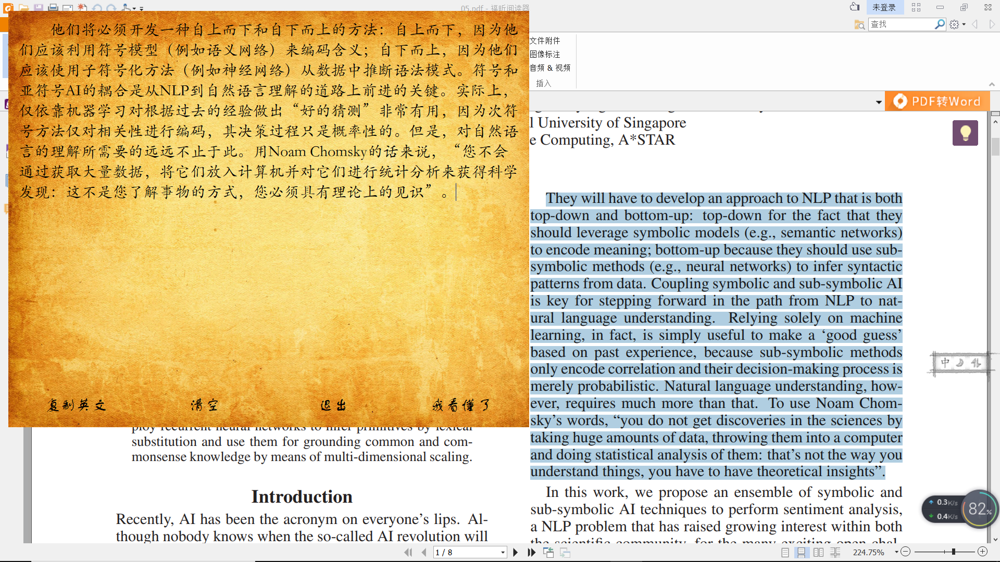
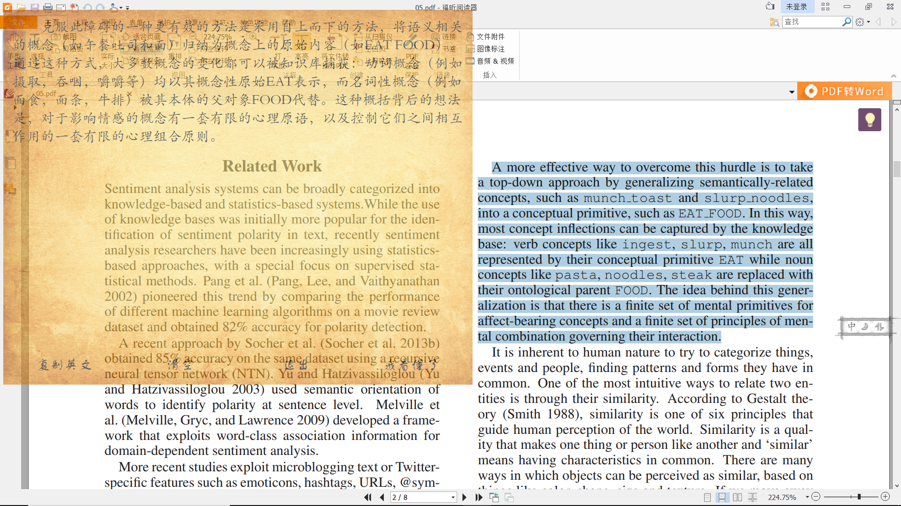

## 0 下载
## 1 运行如下：

```
    pip install -r requirements.txt
```

```
    python gtl_pane.py
```

## 2 运行展示：
 - 鼠标停留


- 鼠标移出


## 3 在``gtl_config.json``中设置窗口参数:

```json
{
        "宽度": 1000,
        "高度": 800,
        "最低透明度": 0.7,
        "渐变": true
}
```


    